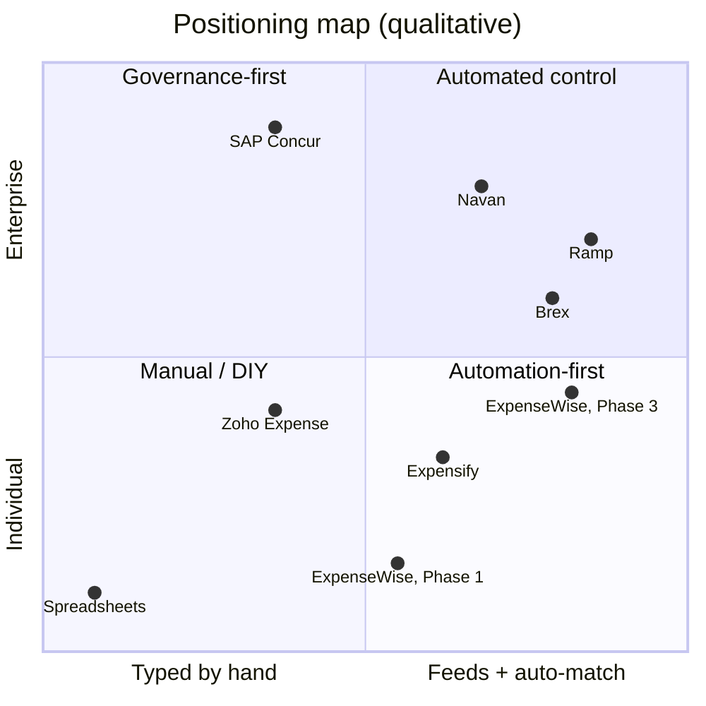

# Vision and scope

What ExpenseWise is, how we will know it works, where the original brief was challenged, and where the product sits in the market (blueprint §1–§2).

## The brief

The brief asked for a full-featured expense, mileage and receipt platform in the spirit of Concur, Ramp and Expensify: web first, iPhone later, with automated receipt handling and submission, reporting and trip history.

The proposal is below in three lines. After that come the six places where the brief needs to change.

## At a glance

| Lens | Position | What it means |
| --- | --- | --- |
| Product | The system drafts; people handle exceptions | ExpenseWise drafts every expense, assembles every report and chases every missing receipt. People confirm the few things it isn't sure about. |
| Architecture | One API, many clients | A TypeScript modular monolith behind a versioned API, with durable workflows for receipt intelligence. The web app is the first client. The iPhone app is the second client, not a rewrite. |
| Delivery | Continuous, gated, measured | Trunk-based delivery with a preview environment for every pull request, six automated quality gates and feature-flagged releases. AI extraction is measured against a labeled eval set. |

Details: [architecture](05-architecture.md), [delivery lifecycle](06-delivery-lifecycle.md).

## Outcome measures

Three outcome measures are instrumented from Phase 1. Targets are starting points and get re-set once we have a baseline.

| Measure | Definition | Target |
| --- | --- | --- |
| Touches per expense | Human interactions needed to take one expense from capture to submitted | Fewer than 1 for clean receipts |
| Trip end → submitted | Human minutes spent after a trip ends, until its report is submitted | Fewer than 5 minutes per trip |
| Submit → reimbursed | Calendar days from submission until money reaches the employee | Baseline in P1, then halve it |

The golden-path journey carries a measure for every stage; see [journeys and workflows](03-journeys-and-workflows.md#42-golden-path-a-business-trip-end-to-end).

## Challenges to the brief

Each challenge states the problem and the position this blueprint takes.

### C1. "Full featured" is a destination, not a scope

Concur has had three decades to build its feature list. Chasing feature parity is how a v1 ships late and does nothing well.

**Position:** Build one golden path, thin and complete: capture → extract → review → report → approve → export. Each phase widens that path, and nothing ships that isn't on it. See the [capability map](02-capability-map.md) and [roadmap](07-roadmap.md).

### C2. Concur, Ramp and Expensify are three different businesses

Concur sells governance to enterprise finance. Ramp sells a corporate card and builds the software around the card data. Expensify sells receipt automation to small businesses and individuals. Each makes different first decisions.

**Position:** Start where Expensify started (receipt-first, individuals and small teams), put Concur-grade audit and approval structure underneath, and adopt Ramp's rule that the transaction is the source of truth once bank feeds arrive. See [ADR-0001](adr/0001-target-segment-and-tenancy.md).

### C3. Web-first conflicts with where the work happens

Receipts get captured at a restaurant table, and miles happen in a car. A web app can use the camera and calculate a route. It cannot detect drives in the background, and it cannot capture reliably offline.

**Position:** Build a mobile-first progressive web app now and design the API for the iPhone app from day one. Automatic mileage is honestly a Phase 3 feature. See [ADR-0004](adr/0004-iphone-technology.md).

### C4. Automation is a data problem more than an OCR problem

Reading a receipt is largely solved. Automating an expense needs something to match the receipt against. Without a transaction feed we can't auto-create expenses from card swipes, spot missing receipts or reliably catch duplicates.

**Position:** Email-in receipts are the cheapest big win, because airlines, hotels and ride-share already email receipts. None of them offers an API to small apps ([§6.11](05-architecture.md#611-travel-data)), so email-in moves into Phase 1 ([D-11](adr/0011-travel-data-sources.md)). Bank feeds multiply the automation ([D-07](adr/0007-bank-and-card-feeds.md): yes).

### C5. Financial records carry obligations from the first receipt

Receipts are tax evidence. IRS guidance calls for keeping records 3 to 7 years depending on circumstances. Approvals need an audit trail, and receipt images contain personal data.

**Position:** Tenant isolation, an append-only audit log, 7-year configurable retention and PII rules all go into Phase 0. They are cheap now and expensive to retrofit. See [security, privacy and compliance](05-architecture.md#69-security-privacy-and-compliance).

### C6. One builder in four roles removes separation of duties

If one builder architects, builds, tests and deploys, the author is reviewing their own work. That is the classic failure mode of a small team.

**Position:** Automated gates act as the independent reviewer. The product owner accepts each increment and approves every production promotion. Claude runs an adversarial review pass on every pull request before it reaches the product owner. See [delivery lifecycle](06-delivery-lifecycle.md).

## Positioning

Products differ on how much of the capture happens automatically, and on how much governance the product enforces. The map shows where ExpenseWise should enter and which way it should move.

### Positioning map

**These positions are qualitative judgments for framing, not measurements.** The coordinates below only reproduce the relative placement in the blueprint's figure.

- Horizontal axis, capture automation: typed by hand → scan + email-in → feeds + auto-match.
- Vertical axis, governance depth: individual → team → enterprise.

ExpenseWise enters as an automation-first tool for individuals and teams, then moves toward automated control as bank feeds, the policy engine and multi-step approvals land (Phase 1 → Phase 3).

### What we take from each, and what we leave

| Product | Built around | We take | We leave |
| --- | --- | --- | --- |
| SAP Concur | Policy, travel and ERP integration for large enterprises | Policy engine depth, multi-level approval routing, audit trail, per-diem rules | Form-heavy entry; configuration that needs consultants |
| Ramp | Corporate cards; software funded by card revenue | Transaction-first data model, missing-receipt nudges, auto-matching, fast accounting sync | Issuing our own card. It is a regulated business; if we ever do it, we do it through a partner. |
| Expensify | Receipt scanning for small businesses and individuals | Scan-and-forget capture, email-in receipts, scheduled submit, chat-style help | Plan and pricing complexity |
| Navan | Travel booking with expense attached | The trip as the organizing unit: bookings create the trip, and receipts file into it | Running a travel agency. Booking inventory is a separate business. |
