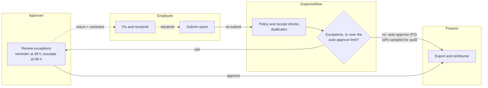
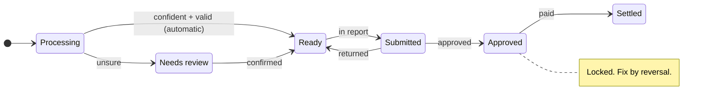
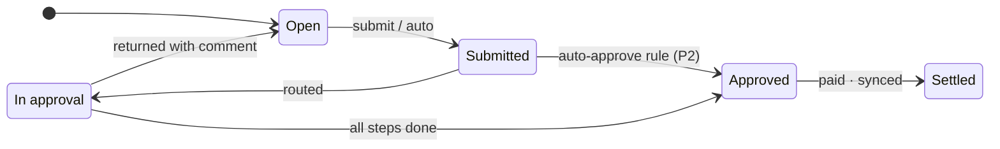

# Journeys and workflows

Four people, one trip, and the workflows between them: the personas, the golden path, mileage, approval, lifecycles, automation rules and month-end close (blueprint §4).

Design and architecture both start here. The personas set the jobs to be done, the trip journey sets the golden path, and the workflows and lifecycles set the business rules the system has to enforce.

## 4.1 Personas

| Persona | Profile | Job to be done | Pain today | Win |
| --- | --- | --- | --- | --- |
| Alex · road warrior | Sales engineer. 2–3 trips a month, about 40 receipts. | Get reimbursed without doing paperwork. | Rebuilding a trip from a pocket of receipts on Sunday night. | Snap, forget, get paid. |
| Jordan · approver | Team lead. Approves 6–10 reports a month. | Approve with confidence in under a minute. | Scrolling forty lines to find the one that matters. | Only exceptions reach Jordan's desk. |
| Sam · finance admin | Controller at a 60-person firm. | Close the month with complete, coded, compliant spend. | Chasing missing receipts and re-keying into the ledger. | The export reconciles first time. |
| Riley · solo professional | Consultant in a one-person organization who submits and approves their own spend; each approval is recorded as a self-attestation. | Keep tax-ready expense and mileage records. | Mileage logs rebuilt from a calendar at tax time. | A year-end summary the accountant accepts. |

## 4.2 Golden path: a business trip, end to end

This journey is the Phase 1 acceptance test. If Alex, Jordan and Sam can complete it with no spreadsheet and no re-keying, the golden path works.

| Stage | Alex does | ExpenseWise automates | Moment that matters | Measure |
| --- | --- | --- | --- | --- |
| Plan | Creates the trip, or forwards the itinerary to the receipts address so the trip is created automatically (P2) | Sets the trip window and policy context: city and dates, with per diem later | The trip exists before the first receipt does | % of trips created before travel |
| Travel | Forwards airline and hotel emails; snaps taxi receipts | Extracts fields in seconds and files each expense to the trip by date | Shutter to "filed" feels instant | p95 capture → Ready < 30 s |
| On site | Snaps meals; logs the client drive by route | Suggests categories, asks for attendees on meals over the limit (P2) and flags policy problems at capture (P2) | Policy problems surface now, not three weeks later | % of violations caught at capture |
| Wrap-up | Clears the inbox: two quick checks and one missing receipt | Closes the trip 48 h after it ends, assembles the report and auto-submits when clean (P2) | The report writes itself | Human minutes per trip < 5 |
| Approval | Nothing, unless the report comes back | Routes by manager, and by amount (P2), highlights only exceptions and sends a reminder at 48 h (P2) | Approvers trust the clean reports | Median approval time |
| Settlement | Gets paid, and can see the status at every step | Codes to the GL, batches the export and schedules the payout (P3) | Money arrives when promised | Submit → paid (days) |

The Phase 1 acceptance test covers the unmarked cells; cells marked (P2) or (P3) describe the target experience.

## 4.3 Mileage

Three ways in, one standard of evidence. This is where web-first costs the most, so here is exactly what each mode can and can't do.

| Mode | How it works | Evidence captured | Runs on | Phase |
| --- | --- | --- | --- | --- |
| Manual | Enter miles, date, destination and purpose | Date, destination, purpose, miles, note | Web | P1 |
| Route-based | Enter start, stops and end. A routing API returns the distance, with a round-trip toggle and saved places such as home, office and airport. | Route summary, distance source, rate snapshot | Web | P1 |
| Automatic | The phone detects drives in the background. You swipe each one as business or personal. | Trace summary, start and end points, times | iPhone only | P3 |

> **IRS Publication 463.** Every mode records date, destination, business purpose and miles, which are the elements IRS Publication 463 asks for. Each entry snapshots the rate in force on the day of travel, so a later rate change never alters an old claim.

## 4.4 Approval workflow

Humans see only exceptions. Each lane below is a swimlane in the blueprint's figure.

- A report with no exceptions that falls under the organization's limit skips human approval, and 10% of those are sampled for audit.
- A report over a second threshold, say $2,500, adds a finance approver.
- In an organization with two or more members, no one can approve their own report (separation of duties). In a one-person organization, the member may approve their own reports, and the audit event records the approval as a self-attestation.
- Every step in the ExpenseWise lane writes an audit event.
- Auto-approval is a Phase 2 rule. In Phase 1, every report routes to the approver.

## 4.5 Lifecycles

Two lifecycles govern everything. The transitions marked "automatic" and "auto-approve" are the automated paths we optimize for.

### Expense lifecycle

### Report lifecycle

An approved expense is locked. A correction creates a reversing entry and a new version, so the audit trail never loses what was approved.

## 4.6 Automation rules

This is where "automated submission" actually lives. Each rule has a guardrail, because automation that people can't predict is automation they switch off.

| When | ExpenseWise | Guardrail | Phase |
| --- | --- | --- | --- |
| A receipt is read with high confidence | Creates a Ready expense and files it to the matching trip | Per-field confidence threshold; arithmetic and date validation must pass; a trip a person chose for it wins ([ADR-0023](adr/0023-expenses-file-to-trips-by-date.md)) | P1 |
| A trip's end date passes plus 48 h | Assembles a draft report and notifies the traveler | Skips trips with no expenses; traveler can reopen | P1 |
| The scheduled submit time arrives (trip end, weekly or monthly) | Submits the report automatically | Only when nothing needs review and no receipt is missing | P2 |
| A card transaction still has no receipt after 24 h | Nudges by email with a one-tap capture link (push joins in P3) | At most one nudge a day; quiet hours respected | P2 |
| A report has no exceptions and is under the auto-approve limit | Approves it automatically | 10% random sample goes to finance; never applies to the approver's own reports | P2 |
| An approver has been idle for 48 h, then 96 h | Reminds, then escalates to the delegate | Delegates act within their own approval limits | P2 |
| Approved reports reach the export cutoff | Posts them to QuickBooks or Xero as one batch | Idempotent batch key; closed periods are locked | P2 |
| The phone detects a drive over 1 mile in work hours | Drafts a mileage entry for a swipe decision | Opt-in; drives stay private until classified as business | P3 |

## 4.7 Month-end close

Sam's month-end close, in five steps:

1. **Cutoff.** The period closes on the organization's schedule; late items roll forward.
2. **Exceptions queue.** Sam sees only flagged, unmatched or over-threshold items.
3. **Sample audit.** A random 10% of auto-approved reports, plus every report over threshold.
4. **Export to ledger.** One idempotent batch to QuickBooks, Xero or CSV, coded to GL accounts.
5. **Lock period.** Approved records freeze. Later corrections post as reversals in the next period.

## Related

- [App design](04-app-design.md): the screens that carry these journeys.
- [Architecture](05-architecture.md): the receipt path and pipeline behind the automation rules.
- [Capability map](02-capability-map.md): the phase of each capability used here.
