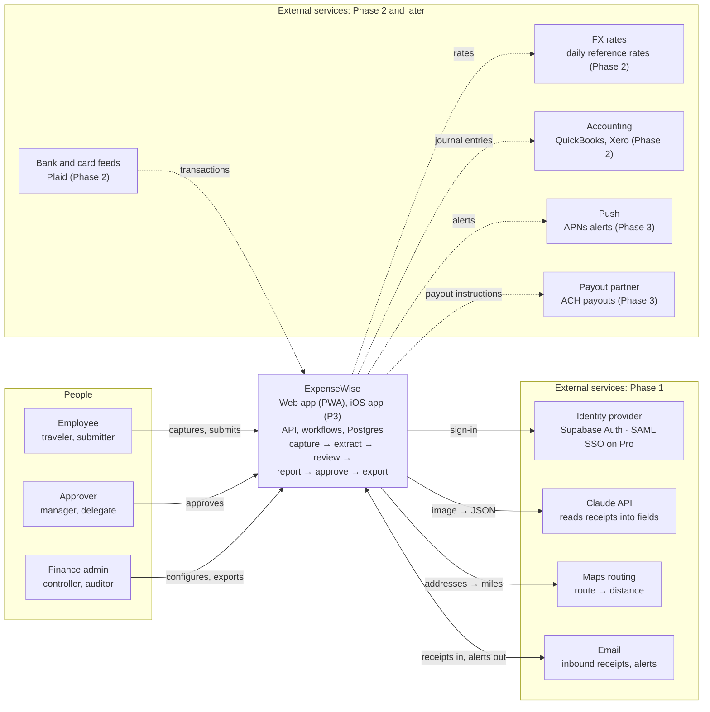
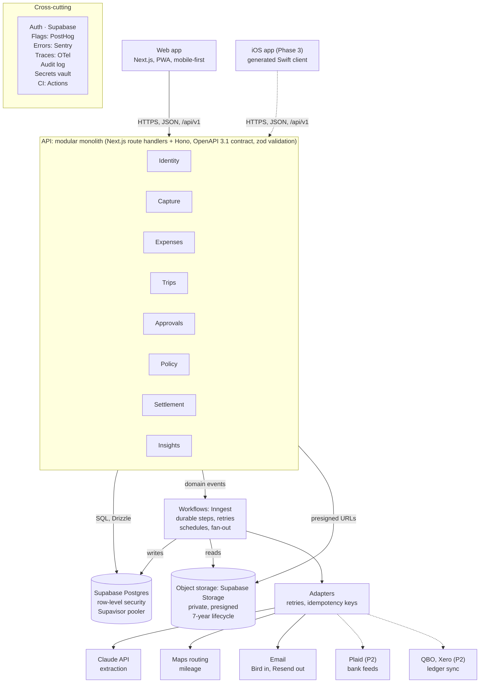
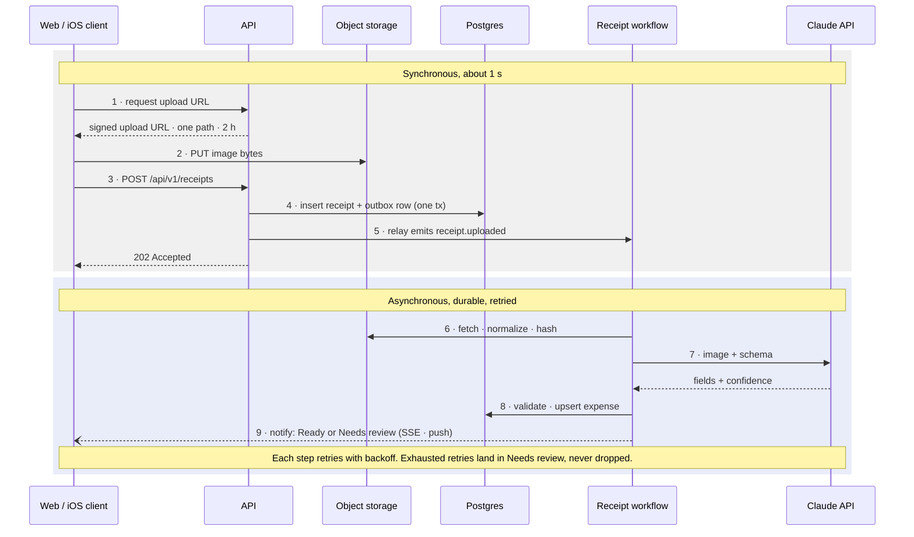
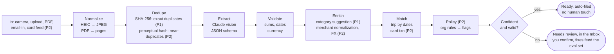
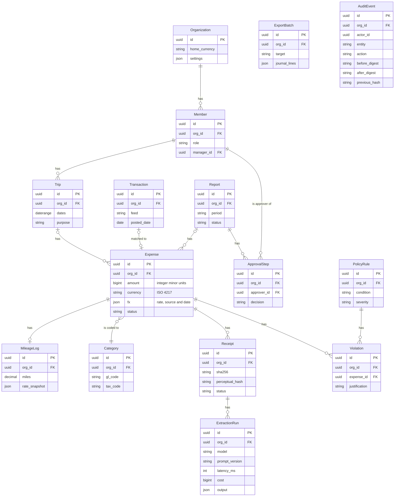
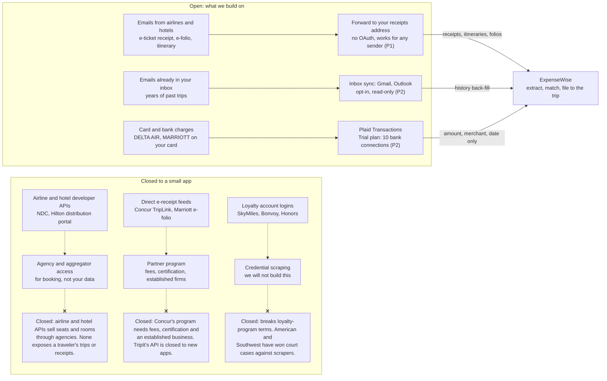

# Architecture

A modular monolith behind one API, with an asynchronous brain: principles, context, containers, the receipt path, the domain model, the stack, security, the iPhone app and travel data (blueprint §6).

The shape follows from the journeys. People need an answer in about a second, while receipts need seconds of careful reading. So the synchronous path stays thin, and everything slow runs as durable, retryable workflows. One versioned API serves the web app now and the iPhone app later.

## 6.1 Architecture principles

| ID | Principle | Summary | What it means |
| --- | --- | --- | --- |
| AP1 | API-first | Clients are interchangeable | The web app is the first client of a versioned, OpenAPI-described API, and iOS is the second. No business rule lives in a client. |
| AP2 | Modular monolith | One deployable, hard boundaries | Modules own their data and talk through interfaces. A module becomes a service only when it has to scale or release on its own. Microservices for a team this size would be operational debt with no payoff. |
| AP3 | Async by default | The user never waits on AI | Anything slow or external runs in a durable workflow with retries and idempotency. Capture returns in about a second. |
| AP4 | Append-only history | Nothing approved is ever edited | Every state change emits an audit event. Approved records change only by reversal and new version. |
| AP5 | Exact money | Integers and currency codes | Amounts are stored as integer minor units with an ISO 4217 code. Converted amounts store their rate, source and date. We never use floats for money. |
| AP6 | Isolation in the database | Every row knows its tenant | Every table carries `org_id`. Postgres row-level security backstops the application's own checks. |
| AP7 | Buy the commodity | Build only what differentiates | Identity, AI models, bank feeds, email and payouts are integrations behind adapters. Workflow, matching, policy and UX are ours. |
| AP8 | Ship dark | Deploy is not release | Every capability sits behind a feature flag, so code reaches production long before customers see it. |

## 6.2 System context

Three kinds of people, nine external services, one system boundary. Solid edges are Phase 1; dashed edges are Phase 2 and later.

The dashed services arrive later, but their adapters and data shapes are designed in Phase 0, so adding them doesn't reshape the core.

## 6.3 Containers

One deployable API, two stores (Postgres and object storage), one workflow engine. Dashed edges are Phase 2 and later.

- The API has eight modules. Each module owns its tables, and modules call each other only through public interfaces. A module becomes a service only when it must scale or release on its own.
- Clients call `/api/v1/…`. Inside the API package, routes are declared as `/v1/…` under the OpenAPI server base `/api`.
- The API never calls a slow external service inline. It records intent and emits an event, and workflows do the rest behind adapters that own retries, rate limits and idempotency keys.

## 6.4 Receipt path

Image bytes never pass through the API, and the user is free about a second after the shutter.

- **Outbox pattern.** Step 4 writes the receipt row and its event in one transaction, so a receipt can never exist without the event that processes it.
- **Eager dispatch ([ADR-0017](adr/0017-read-receipts-with-two-models.md)).** Step 5 sends the committed event to the workflow runner at once, with the outbox id as its event id. The relay's sweep delivers anything that send missed, and the runner drops the duplicate.
- **Safe retries.** Step 3 carries a client-generated ID and hash, so a retry on a flaky connection can't create a duplicate.

## 6.5 Receipt intelligence pipeline

AI reads the receipt, and deterministic code decides what happens next.

The model does one job, Extract. Every other stage, and every workflow decision, is ordinary tested code. The confidence threshold is set per field (a wrong total costs more than a wrong merchant spelling) and tuned against the eval set.

### Model strategy (D-06)

Start with the most capable Claude tier at low effort to set the accuracy ceiling. Then run a mid tier and the smallest tier against the same eval set. A cheaper tier ships only if it holds accuracy on every field, and the product owner makes that trade once we have the numbers. See [ADR-0006](adr/0006-receipt-extraction.md).

### Structured outputs

Responses are constrained to our JSON schema: merchant, date, currency, total, subtotal, taxes, tip, card last four, line items, document type and per-field confidence. There is no free-text parsing.

### Cost

Estimated at roughly 2–3¢ per receipt on the most capable tier at list price, and well under 1¢ on the smallest tier. Prompt caching keeps the fixed instructions cheap. Bulk re-processing after a prompt or model change goes through the Batch API at half price. The Phase 0 spike measures the real figure.

### Receipts are untrusted input

The model gets no tools and can only return data in our schema, so receipt text that looks like an instruction is just data. Every run stores model, prompt version, latency, cost and output, so any figure can be traced to what read it.

Extraction sits behind an `Extractor` interface. In the spike, a receipt-specialist API (Veryfi, Mindee or AWS Textract AnalyzeExpense) is benchmarked on the same set as a comparison and a fallback.

## 6.6 Domain model

Modules own their entities; the Expense is the hub.

| Module group | Entities |
| --- | --- |
| Identity | Organization, Member |
| Expenses and trips | Trip, Expense, MileageLog, Category |
| Capture and intelligence | Transaction (P2), Receipt, ExtractionRun |
| Governance | Report, ApprovalStep, PolicyRule (P2), Violation (P2) |
| Settlement | ExportBatch |
| Platform | AuditEvent |

- **Tenancy.** Every tenant table carries `org_id`, as the diagram shows.
- **Audit log.** AuditEvent is append-only and hash-chained. Every state change in every module appends an event, and rows are never updated or deleted. Each event stores the hash of the one before it, so tampering with history is detectable.
- **Reading the diagram.** Cardinalities follow the blueprint's figure, with these refinements: an expense may have no trip and no report, each approval step links to its approver (a Member), and each violation links to its expense. Attribute names and types are indicative: the blueprint names the attributes, not the columns. Transaction, PolicyRule and Violation arrive in Phase 2.

## 6.7 Data conventions

- **Money:** integer minor units plus an ISO 4217 code. Converted amounts store the rate, its source and its date.
- **Time:** instants in UTC, and transaction dates as local calendar dates. An 11 pm dinner in Tokyo stays on that day.
- **Identifiers:** UUIDv7, which is time-ordered and safe to generate on a phone while offline, so the ID doubles as the idempotency key for a sync.
- **No hard deletes of financial records:** corrections are reversals and new versions.
- **Snapshots over lookups:** mileage rate, FX rate, policy version and category mapping are copied onto the record at the time they applied.

See [ADR-0008](adr/0008-money-and-data-conventions.md).

## 6.8 Technology stack

| Layer | Choice | Why | Considered |
| --- | --- | --- | --- |
| Language | TypeScript, strict | One language for web, API and workers; typed contracts end to end | Python backend (its OCR advantage fades with model-based extraction) |
| Repository | pnpm + Turborepo monorepo | Shared `domain`, `db`, `contract` and `ui` packages with cached builds | Nx |
| Web | Next.js + React | Mature, PWA-capable, first-class preview deployments | React Router, SvelteKit |
| UI | Tailwind + shadcn/ui | Accessible Radix primitives we own as source | MUI, Chakra |
| API | Hono in route handlers, zod-openapi | Contract-first; generates TypeScript and Swift clients | tRPC (TypeScript-only clients, which rules out Swift); NestJS |
| Database | Supabase Postgres + Drizzle | Relational integrity for money, row-level security; auth users live in the same database | Neon (previous choice), RDS / Aurora |
| Files | Supabase Storage (S3-compatible endpoint) | Private buckets and signed upload and download URLs, with the same vendor as auth and data | Cloudflare R2 (previous choice), AWS S3, Vercel Blob |
| Workflows | Inngest | Durable steps, retries, schedules and idempotency on serverless | Trigger.dev, Temporal (heavier), SQS + Lambda |
| Identity | Supabase Auth | Users live in the project's own Postgres; TOTP MFA; SAML SSO on Pro; supabase-swift SDK for iOS | Clerk (rejected by the product owner), Auth.js / Better Auth, WorkOS |
| Extraction | Claude API, vision + structured outputs | Reads messy receipts; returns schema-valid JSON | Textract AnalyzeExpense, Veryfi, Mindee |
| Maps | Google Routes API | Route distance for mileage | Mapbox Directions |
| Email | Bird inbound ([ADR-0024](adr/0024-inbound-email-through-bird.md)), Resend outbound | An inbound address without a domain of ours; simple transactional sending | Postmark inbound, Amazon SES |
| Flags and analytics | PostHog | Feature flags and product analytics in one place | LaunchDarkly + Amplitude |
| Observability | Sentry + OpenTelemetry | Errors, traces and workflow timings | Datadog |
| Hosting and CI | Vercel + GitHub Actions | Preview per pull request, instant rollback, rolling releases | AWS ECS / Fargate + CodePipeline |

Portability is designed in: standard Postgres, the S3 API and containerizable Node. Leaving any vendor is a migration, not a rewrite, and each ADR records its exit path. See [ADR-0002](adr/0002-architecture-style.md), [ADR-0003](adr/0003-platform.md) and [ADR-0013](adr/0013-supabase-platform.md).

## 6.9 Security, privacy and compliance

| Area | Control |
| --- | --- |
| Tenant isolation | `org_id` on every row, Postgres row-level security, and cross-tenant read and write tests in CI (gate G3). |
| Data API lockdown | The Supabase Data API stays enabled (the product owner's choice), but it cannot reach our data. The API is the only path to data; we do not use supabase-js or PostgREST for data. Migration 0002 revokes every grant and default privilege from `anon`, `authenticated` and `service_role`, and tests recreate Supabase's defaults to prove it ([ADR-0013](adr/0013-supabase-platform.md)). |
| Database roles | The Supabase `postgres` role has BYPASSRLS, so it is used only for migrations; the integration's `POSTGRES_URL` is never the runtime connection. The API connects as `expensewise_app` through the shared pooler in transaction mode, and refuses to start tenant work if its role is a superuser or has BYPASSRLS. |
| Receipt images | Private bucket. Each signed upload URL is good for one path (`orgs/{orgId}/receipts/{receiptId}`) and expires after Supabase's fixed 2 hours; an outbox job validates every upload. Reads use short-lived signed URLs. Location metadata is read for trip matching, then stripped from stored copies. |
| Access control | Roles: Member, Approver, Finance admin, Owner and Auditor (read-only). In an organization with two or more members, no one approves their own spend (separation of duties). A one-person organization may approve its own reports, and the audit event records a self-attestation. The domain function `canApprove()` returns the basis: `separation_of_duties` or `solo_self_attestation`. Approving someone else's spend and admin actions need step-up MFA (`aal2`); a one-person organization's self-attestation does not. |
| Data protection | TLS everywhere and encryption at rest. We store only card last four. Secrets live in the platform vault, with secret scanning on every push. |
| Retention and privacy | 7-year default retention, configurable, with legal hold. Deletion requests are honored except where records must be kept. Every subprocessor signs a data processing agreement. |
| Standards path | OWASP ASVS Level 2 is the build standard from day one. A SOC 2 Type I audit comes when the product is sold to businesses; a business customer's security review is the usual trigger ([D-10](adr/0010-residency-and-compliance.md)). |

## 6.10 How the iPhone app slots in

- **Contract first.** OpenAPI is the source of truth, the Swift client is generated from it, and CI blocks breaking changes that lack a new version.
- **Offline-safe writes.** Client-generated UUIDv7 IDs and idempotency keys mean a receipt captured on a plane syncs exactly once.
- **Browser-free auth.** Short-lived access tokens with refresh, through the supabase-swift SDK, with native Sign in with Apple.
- **One notification service.** APNs push goes through the same service that sends email today.
- **Old app versions live for months.** Each API version therefore carries a 6-month deprecation window, and CI runs contract tests against the oldest supported version.

See [ADR-0004](adr/0004-iphone-technology.md).

## 6.11 Travel data

Which doors are open. None of Delta, United, American, Southwest, Marriott, Hilton, IHG or Hyatt gives third-party apps access to a traveler's own bookings, receipts, folios or loyalty activity (checked 30 September 2026). Their developer programs exist to sell seats and rooms through agencies. Delta's SkyMiles rules explicitly forbid giving account access to aggregation apps.

The inbox is the integration. Airlines and hotels don't give a traveler's data to small apps. They email it to the traveler instead. Every open route ends in ExpenseWise, and every closed one is closed for a structural reason that effort won't fix.

### Recommended: D-11

Move the email-in forwarding address from Phase 2 into Phase 1. Without an airline or hotel API, it is the only automatic route for travel receipts, and it needs no OAuth review. Opt-in Gmail and Outlook inbox sync, for back-filling past trips, stays in Phase 2. See [ADR-0011](adr/0011-travel-data-sources.md).

### How emails get read

Use schema.org reservation markup when an email carries it. Otherwise Claude reads the email body and any PDF attachment against the same schema used for receipts. Per-vendor HTML parsers are a maintenance trap when templates change, so we add one only if the eval set shows a sender we keep missing.

### The folio gap

Plaid shows a hotel charge but not the nightly breakdown. IRS Publication 463 expects documentary evidence for lodging whatever the amount. So a hotel charge with no folio after 24 h becomes an inbox item: "Ask the hotel to email your folio and forward it." Ramp reportedly built agents that call hotels for folios, so this gap is industry-wide.

### Inbox sync rules

Gmail read access is a restricted scope. An unverified app in production is capped at 100 users for its lifetime, which fits the product owner and a small team. Google's verification and paid CASA security assessment (roughly $540 a year and up) only become necessary when we sell. Testing mode would force re-consent every 7 days, so we won't use it. Outlook, through Microsoft Graph Mail.Read, needs no audit.

### Flight data: not yet

Itinerary emails already carry flights, dates and cities. If we later need actual departure times or distances, AeroDataBox has a free tier and commercial plans from about $19 a month. FlightAware's personal tier is non-commercial only.

### Becoming the booking channel

Booking flights through Duffel ($3 per order) would give us first-party trip data, but it makes ExpenseWise a travel seller. That stays on the Horizon (P4). Amadeus closed its self-service APIs in July 2026.

## Related

- [Journeys and workflows](03-journeys-and-workflows.md): the lifecycles and rules this architecture enforces.
- [Delivery lifecycle](06-delivery-lifecycle.md): environments, gates and release management.
- [ADR index](adr/README.md).
