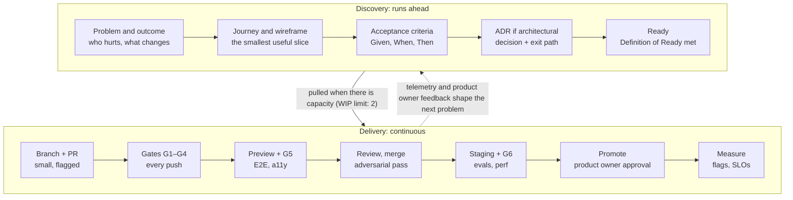

# Delivery lifecycle

Dual-track, trunk-based, continuously delivered: operating model, roles, environments, quality gates, test strategy, Definitions of Ready and Done, and release operations (blueprint §7).

Discovery decides what is worth building; delivery ships it in small, flagged, verified slices. The lifecycle is built for a team of one human and one AI builder. That means heavy automation, explicit human gates where judgment matters, and none of the Scrum ceremonies that only pay off for larger teams. See [ADR-0009](adr/0009-delivery-model.md).

## 7.1 Operating model

Two human gates sit at the points of highest leverage:

1. **What counts as Ready.** The product owner agrees the acceptance criteria.
2. **What reaches customers.** The product owner approves promotion by asking for the merge, which releases it ([ADR-0019](adr/0019-merge-is-the-release.md)).

Everything between them is automated or adversarially reviewed. Work runs as continuous flow, with a two-week increment for demo, acceptance and re-planning.

## 7.2 Roles and accountability

| Activity | Product owner | Claude (architect, dev, QA, deploy) | Automated gates |
| --- | --- | --- | --- |
| Priorities and phase scope | A, R | C | – |
| Journeys and acceptance criteria | A | R | – |
| Architecture decisions (ADRs) | A | R | – |
| Build, unit and integration tests | I | A, R | V |
| Adversarial code and security review | I | A, R | V |
| Accepting an increment | A, R | C | V |
| Promoting to production | A | R | V |
| Incident diagnosis and rollback | I | A, R | V |

**Legend:** A = accountable, R = responsible, C = consulted, I = informed, V = verifies independently.

## 7.3 Environments

| Environment | Purpose | Data | Deployed | Keys |
| --- | --- | --- | --- | --- |
| Local | Build and debug | Seeded fixtures, Postgres in Docker, workflow dev server | On demand | Test keys |
| Preview | One per pull request | The shared staging Supabase project, with synthetic data; no per-PR database | Every push | Staging Supabase keys: publishable key (client), secret key (server only). Other sandbox keys (Plaid sandbox, capped Claude workspace). |
| Staging | Integration and release candidate | Staging Supabase project: synthetic data plus the anonymized eval receipts | Every merge to main | Supabase publishable key (client), secret key (server only). Other sandbox keys. |
| Production | Customers | Production Supabase project: real data, isolated by tenant | Promotion with product owner approval; flags control exposure | Supabase publishable key (client), secret key (server only). Other live keys, least privilege. |

- CI gates run against a Postgres service container, so no per-PR database is needed.
- End-to-end tests against a preview create their own organization for each run, so parallel runs on the shared staging project stay isolated by the same row-level security that separates customers.
- Custom database role passwords, such as `expensewise_app`'s, are never in migrations and don't survive a restore or a new project. After a restore, the runbook re-sets them from secrets ([ADR-0013](adr/0013-supabase-platform.md)).

## 7.4 Quality gates

| Gate | Checks | Tooling | Runs | Blocks |
| --- | --- | --- | --- | --- |
| G1 Static | Format, lint, strict types | Prettier, ESLint, tsc | Every push | Merge |
| G2 Unit | Domain rules, money math, state machines, property tests; ≥ 90% coverage on the domain package | Vitest, fast-check | Every push | Merge |
| G3 Integration | API against real Postgres, cross-tenant RLS tests, migrations on a copy, OpenAPI breaking-change diff | Vitest, Testcontainers, oasdiff | Every push | Merge |
| G4 Security | Dependency audit, secret scan, static analysis, license check | OSV-Scanner, gitleaks, CodeQL | Every push, plus nightly | Merge on high or critical. An advisory with no fixed version may be let through by the product owner: listed in `pnpm-workspace.yaml`, recorded as a gap, and checked weekly by Advisory watch |
| G5 Preview | Critical journeys end to end, accessibility | Playwright, axe-core | Every pull request preview | Merge |
| G6 Release | Full E2E, extraction evals when prompts or models change, performance budgets, DAST baseline | Playwright, eval harness, Lighthouse CI, k6, OWASP ZAP | Staging | Promotion |

## 7.5 Test strategy

| Layer | Scope | Tools | Bar |
| --- | --- | --- | --- |
| Static | Types at every boundary; zod validates all input | TypeScript strict, ESLint | Zero errors |
| Unit | Money, FX, policy, mileage, state machines | Vitest | 90% line and branch coverage on the domain package |
| Property-based | Invariants: splits sum to the total, conversions round-trip within one minor unit, no illegal state transitions | fast-check | Runs in G2 |
| Integration | API, Postgres, RLS and workflows together | Vitest, Testcontainers | Every endpoint has a happy-path test and an authorization test |
| Contract | OpenAPI spec against the implementation, breaking-change diff | oasdiff, schema tests | No unversioned breaking change |
| End-to-end | 10 critical journeys, including a mobile Safari viewport | Playwright | All pass; flaky tests get fixed, never skipped |
| AI evals | Field-level accuracy on a labeled receipt set | Eval harness + Batch API | No field regresses by more than 1 point |
| Non-functional | Accessibility, performance, security | axe, Lighthouse CI, k6, ZAP | WCAG 2.2 AA; LCP < 2.5 s on 4G; API p95 < 300 ms |
| Exploratory | Charter-based sessions with real-world receipts, every increment | Product owner + Claude | Each finding becomes an automated test |

### QA note: why AI extraction needs evals, not only tests

A unit test proves that code does what it says. An eval measures how often the model reads a receipt correctly. There is no shoebox of receipts, so the set is built in layers, and accuracy is always reported by layer:

1. **Public datasets.** CORD v2 and SROIE under CC BY 4.0, and ExpressExpense US restaurant receipts under MIT.
2. **Synthetic documents.** Hotel folios and e-ticket receipts with known answers, since no public folio dataset exists.
3. **The product owner's past travel emails,** if the product owner allows it ([D-12](adr/0012-eval-set-composition.md)).
4. **Real captures.** Every receipt captured from Phase 1 on.

Public and synthetic data flatter the model, so the tier choice is re-confirmed after about 100 real receipts (roughly four weeks of everyday capture). Every correction in the inbox becomes a candidate for the set.

## 7.6 Definition of Ready and Definition of Done

### Definition of Ready

A story can start when:

- [ ] It links to a journey step and a capability in the [capability map](02-capability-map.md).
- [ ] Acceptance criteria are written as Given / When / Then and agreed by the product owner.
- [ ] A wireframe exists, or UI is explicitly out of scope.
- [ ] Data and migration impact is noted; an ADR exists if the story is architectural.
- [ ] The feature flag is named and the test approach is sketched.

### Definition of Done

A story is finished when:

- [ ] Gates G1–G5 are green, and acceptance criteria run as automated tests.
- [ ] State changes emit audit events, and telemetry events are added.
- [ ] Accessibility is checked, and docs, ADRs and the requirement records (`tools/records`) are updated in the same pull request.
- [ ] It has been demonstrated on its preview environment and accepted by the product owner.
- [ ] It is in production behind a flag, default off until release.

## 7.7 Release management and operations

### Versioning

Every deploy is identified by its commit. Weekly release notes are generated from Conventional Commits. The API is versioned in the path (`/api/v1`) with a 6-month deprecation window.

### Database changes

Expand, migrate, contract. Migrations run before the deploy and must work with the previous release's code. Nothing destructive ships in the same release as the code that stops using it.

### Progressive exposure

Each capability is flagged: internal first, then a beta cohort, then everyone. Risky infrastructure changes use a rolling release with automatic halt on error-rate increase.

### Rollback

Instant rollback to the previous deployment, with flags as kill switches. Database fixes roll forward, which is why migrations must be backward compatible.

### Backups and recovery

Production runs on Supabase's Free plan in Phase 1, which has no backups, so we keep our own ([ADR-0014](adr/0014-supabase-free-plan.md)). A nightly GitHub Actions job encrypts a dump of the database, auth users included, and copies new receipt images to a private Backblaze B2 bucket. Dumps are kept for 30 days plus 12 monthly copies; receipt images are never deleted from the copy. The same job writes a heartbeat so the project isn't paused for inactivity, and fails at 70% of a Free plan limit. A monthly workflow restores the latest backup into a throwaway database and checks row counts, row-level security and image checksums; the first drill on real data is part of the Phase 1 exit criteria. Recovery point: 24 hours. Recovery time: 4 hours. Point-in-time recovery is deferred until the product is sold ([ADR-0013](adr/0013-supabase-platform.md)).

### Incidents

Alerts fire on SLO burn rate and go to the product owner. Claude diagnoses and prepares the fix or rollback, and a blameless review follows within 5 working days.

### Service level objectives

| Service level objective | Target | Measured by |
| --- | --- | --- |
| API availability | 99.9% monthly | Synthetic checks and edge logs |
| Capture → Ready latency | p95 < 30 s | Workflow timestamps |
| Receipt never lost | 100% reach Ready or Needs review | Hourly reconciliation job |
| Extraction accuracy, total amount | ≥ 98% on the eval set | Eval harness; target confirmed after the Phase 0 baseline |

### Error budget policy

When a budget is spent, feature work pauses until reliability recovers.

## Related

- [Roadmap](07-roadmap.md): phase exit criteria.
- [Risk register](08-risk-register.md): R7 (self-review blind spots) is mitigated here.
- [Architecture](05-architecture.md): what the gates test.
