# Roadmap

Five phases, each ending in something the product owner can use, with indicative durations in weeks (blueprint §8).

Durations are indicative. They assume one AI builder working in daily sessions, with the product owner accepting each increment. Phase 0 measures real throughput, and we re-plan at every two-week increment.

## Timeline

```mermaid
gantt
    title Roadmap in weeks (indicative)
    %% Mermaid gantt needs a time axis. One minute on this chart stands for one week, so the axis reads in weeks from 0.
    dateFormat HH:mm
    axisFormat %M
    tickInterval 4minute
    todayMarker off
    section Phases
    P0 Foundations (weeks 0–2)                      :p0, 00:00, 2m
    P1 Golden path MVP (weeks 2–10)                 :p1, after p0, 8m
    P2 Automate (weeks 10–18)                       :p2, after p1, 8m
    P3 iPhone and scale (weeks 18–30)               :p3, after p2, 12m
    P4 Horizon, partner-led (week 30+, open-ended)  :p4, after p3, 2m
```

The axis is in weeks. Phase 4 has no end; its bar length is only a marker.

## Phases

| Phase | Weeks | Scope | Exit |
| --- | --- | --- | --- |
| P0 · Foundations | 0–2 | Monorepo, gates G1–G5, preview environments, auth (Supabase) with organizations and RLS, schema v1, design tokens and app shell, observability, ADRs 0001–0012, and the extraction spike on an eval seed built from public datasets and synthetic hotel folios and e-ticket receipts (see [§7.5](06-delivery-lifecycle.md#75-test-strategy)) | A trivial feature travels from branch to production behind a flag through every gate. The spike reports accuracy and cost per receipt for each model tier, split by data source. |
| P1 · Golden path MVP | 2–10 | Capture (camera, upload, PDF), an email-in forwarding address for travel and ride receipts, the receipt pipeline and inbox, expenses, trips and trip history, manual and route mileage, reports, single-step approval, CSV and PDF export, audit log, email notifications and a personal dashboard | The product owner runs one real month of expenses through it. Clean receipts need fewer than one touch each, no receipt is lost, and the first restore drill passes. Production is upgraded to Supabase Pro before that month begins. |
| P2 · Automate | 10–18 | Gmail and Outlook inbox sync, Plaid bank feeds with matching plus missing-receipt and missing-folio nudges, the policy engine, multi-step approval and delegation, auto-submit and auto-approve rules, multi-currency, split expenses, meal attendees, merchant normalization, learned categorization, near-duplicate detection, QuickBooks and Xero sync, team analytics, and mileage and tax summaries | A pilot team closes a month end to end in ExpenseWise. Auto-submit rate and approval time are measured against targets set at the end of P1. |
| P3 · iPhone and scale | 18–30 | Native iOS app with document-scanner capture, offline queue, push and automatic mileage. Also reimbursement payouts through a partner, SAML SSO, passkeys once Supabase's beta is GA, a public API and webhooks, per diem, recurring expenses and the custom report builder. | TestFlight beta, then App Store release. Drive-detection precision and recall are measured on real drives before automatic mileage is on by default. |
| P4 · Horizon, partner-led | 30+ | Travel booking via partner, ERP connectors, budgets, anomaly detection, SMS and chat capture, and SCIM once the identity provider supports it. Corporate cards through a partner appear only as a candidate that needs its own business case; no card issuing is planned. | Each item needs its own business case. None of them is assumed. |

The model tier chosen in the Phase 0 spike is re-confirmed after about 100 real receipts (roughly four weeks of everyday capture).

## Phase 1 plan

Accepted by the product owner on 2026-10-01. Dates assume increment 0 starts that day and are re-planned at every two-week increment.

**Phase 0 is not finished.** Its infrastructure is live and verified (`/api/v1/health/ready` passes in production), but two exit items remain: the extraction spike, and a trivial change taken to production behind a feature flag. Increment 0 closes them, because the receipt pipeline is designed from the spike's numbers.

**Real use starts in week 4 (D-14).** The exit test is one real month of the product owner's expenses. Run after the build, that month would fall on Thanksgiving to Christmas, the quietest travel weeks, and acceptance would slip to late December. Run alongside the build from Oct 15, it exposes problems while there is time to fix them. Real receipts are audit evidence from that day, so Supabase Pro and the nightly off-site copy of receipt images move into increment 1.

| Increment | Dates | Scope | Ends with |
| --- | --- | --- | --- |
| 0 · Close Phase 0 | Oct 1–3 | Extraction spike on the eval seed (accuracy and cost per receipt for each model tier, by source); feature flags with one flagged change through every gate; error tracking and traces; workflow runner connected to the outbox | A spike report the product owner uses to choose the model tier |
| 1 · Walking skeleton | Oct 1–15 | Email and password sign-in with TOTP; the owner's one-person organization; capture by camera, upload or PDF into private storage; extraction to Ready or Needs review; the Needs you inbox; exact-duplicate detection; Supabase Pro and the nightly receipt-image copy | Real use starts: a receipt is filed as an expense within 30 seconds |
| 2 · Organize the trip | Oct 15–29 | Trips with expenses filed by date; trip history and search; manual mileage with the rate snapshotted; category suggestions; email-in forwarding address; route-based mileage last, so it can slip | A forwarded hotel folio lands on the right trip |
| 3 · Report and approve | Oct 29–Nov 12 | Reports drafted 48 hours after a trip ends; single-step approval (self-attestation solo, separation of duties for teams); CSV and PDF export; audit trail view; email notifications; personal dashboard | The first real trip report is approved and exported |
| 4 · Harden and accept | Nov 12–26 | Invites and roles (the admin console stays this small); restore drill including receipt images; security review; p95 capture to Ready under 30 seconds; accessibility pass; staging project | Phase 1 exit, scored against the exit criteria above |

**Sign-in without a domain (D-15).** Phase 1 uses email and password with TOTP and no custom email domain. The owner's account is created in the Supabase dashboard (auto-confirmed) and public sign-ups stay off. Supabase's built-in email, which is rate-limited and delivers only to members of the Supabase team, covers password resets and the owner's notifications. The forwarding address uses the inbound address Postmark provides. Before a second person is invited, either a sender domain is added or their account is created the same way.

**Scope guards.** The admin console is limited to invites and roles. Team approval ships single-step and is tested with a second test account; polishing it for real teams is Phase 2 work. Route-based mileage is the first item to cut if an increment runs long.

## Related

- [Capability map](02-capability-map.md): the capabilities each phase delivers.
- [Delivery lifecycle](06-delivery-lifecycle.md): increments, gates and the restore drill.
- [ADR index](adr/README.md): the decisions recorded in Phase 0.
