# Roadmap

Five phases, each ending in something the product owner can use, with indicative durations in weeks (blueprint §8).

Durations are indicative. They assume one AI builder working in daily sessions, with the product owner accepting each increment. Phase 0 measures real throughput, and we re-plan at every two-week increment.

## Timeline

```mermaid
gantt
    title Roadmap in weeks (indicative)
    %% Mermaid gantt needs a time axis. One minute on this chart stands for one week, so the axis reads in weeks from 0.
    dateFormat HH:mm
    axisFormat %M
    tickInterval 4minute
    todayMarker off
    section Phases
    P0 Foundations (weeks 0–2)                      :p0, 00:00, 2m
    P1 Golden path MVP (weeks 2–10)                 :p1, after p0, 8m
    P2 Automate (weeks 10–18)                       :p2, after p1, 8m
    P3 iPhone and scale (weeks 18–30)               :p3, after p2, 12m
    P4 Horizon, partner-led (week 30+, open-ended)  :p4, after p3, 2m
```

The axis is in weeks. Phase 4 has no end; its bar length is only a marker.

## Phases

| Phase | Weeks | Scope | Exit |
| --- | --- | --- | --- |
| P0 · Foundations | 0–2 | Monorepo, gates G1–G5, preview environments, auth (Supabase) with organizations and RLS, schema v1, design tokens and app shell, observability, ADRs 0001–0012, and the extraction spike on an eval seed built from public datasets and synthetic hotel folios and e-ticket receipts (see [§7.5](06-delivery-lifecycle.md#75-test-strategy)) | A trivial feature travels from branch to production behind a flag through every gate. The spike reports accuracy and cost per receipt for each model tier, split by data source. |
| P1 · Golden path MVP | 2–10 | Capture (camera, upload, PDF), an email-in forwarding address for travel and ride receipts, the receipt pipeline and inbox, expenses, trips and trip history, manual and route mileage, reports, single-step approval, CSV and PDF export, audit log, email notifications and a personal dashboard | The product owner runs one real month of expenses through it. Clean receipts need fewer than one touch each, no receipt is lost, and the first restore drill passes. Production is upgraded to Supabase Pro before that month begins. |
| P2 · Automate | 10–18 | Gmail and Outlook inbox sync, Plaid bank feeds with matching plus missing-receipt and missing-folio nudges, the policy engine, multi-step approval and delegation, auto-submit and auto-approve rules, multi-currency, split expenses, meal attendees, merchant normalization, learned categorization, near-duplicate detection, QuickBooks and Xero sync, team analytics, and mileage and tax summaries | A pilot team closes a month end to end in ExpenseWise. Auto-submit rate and approval time are measured against targets set at the end of P1. |
| P3 · iPhone and scale | 18–30 | Native iOS app with document-scanner capture, offline queue, push and automatic mileage. Also reimbursement payouts through a partner, SAML SSO, passkeys once Supabase's beta is GA, a public API and webhooks, per diem, recurring expenses and the custom report builder. | TestFlight beta, then App Store release. Drive-detection precision and recall are measured on real drives before automatic mileage is on by default. |
| P4 · Horizon, partner-led | 30+ | Travel booking via partner, ERP connectors, budgets, anomaly detection, SMS and chat capture, and SCIM once the identity provider supports it. Corporate cards through a partner appear only as a candidate that needs its own business case; no card issuing is planned. | Each item needs its own business case. None of them is assumed. |

The model tier chosen in the Phase 0 spike is re-confirmed after about 100 real receipts (roughly four weeks of everyday capture).

## Related

- [Capability map](02-capability-map.md): the capabilities each phase delivers.
- [Delivery lifecycle](06-delivery-lifecycle.md): increments, gates and the restore drill.
- [ADR index](adr/README.md): the decisions recorded in Phase 0.
